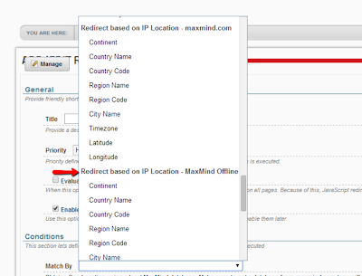

# Extensions

Redirect Toolkit can easily be extended with new types of redirects and actions. This is done from the configuration files, which live under */DesktopModules/RedirectToolkit/Config*. Normally, you'd implement your logic in an assembly that references *avt.RedirectToolkit.Core* and implement an interface like *ICondition* or *IExecutableAction*.

Currently, following plugins are publicly available for Redirect Toolkit:

* MaxMind Offline DB
Normally, Redirect Toolkit comes with a MaxMind integration which uses their Web Services which they charge per request. This extension uses their database which is a one off cost and includes free updates for 1 year.

# MaxMind Offline DB

## Requirements

* DNN 5.5+
* .NET 4+
* Redirect Toolkit 2+
* Full Trust
* One of the MaxMind databases (http://www.maxmind.com/en/geolocation_landing)

## Installation Instructions

1. Make sure you already have Redirect Toolkit installed
2. Install the *RedirectToolkit.MaxMindOfflineDb* extension just as you install new module (via Host > Extensions)
3. Go to Redirect Toolkit admin and add a new rule. In addition to the classic MaxMind Web Service integration, you'll notice a new set of entries for the offline database, as shown in screenshot below.

1. Add a new rule, for example, redirect based on your country name. After you add the rule you'll notice it says "MaxMind DB not present or corrupt.". This basically means that you don't have the MaxMind database yet. Go to http://www.maxmind.com/en/geolocation_landing and select one of the database. Redirect Toolkit works with any of them, so choose according to your app requirements.

2. Once you have a database, unpack it into folder /DesktopModules/RedirectToolkit/Config/Data/MaxMind. This folder does not exist so you'll have to create it in advance. Assuming that you've purchased the Country database, Redirect Toolkit will loot after the following file: */DesktopModules/RedirectToolkit/Config/Data/MaxMind/GeoIP2-Country.mmdb*. 
**Important**: Note that if the folder contains more than one .mmdb files, the first one will be used.

6. Go back to Redirect Toolkit and refresh the screen. Now you should see the proper message for the rule Condition. Logout to test the redirect. Use the override IP feature from General Settings to test various IP addresses. Also keep in mind that on localhost the server will not see your external IP.
