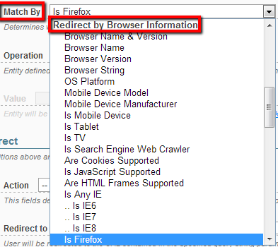

# Browser Information

This is probably the most versatile type of redirect available in Redirect Toolkit. There are two sides of this redirect:

* Browser Information (name, version, *declared capabilities*, etc)
* Device Detection - Problem with this the lack of a standard where devices would just send a flag (saying *I'm a device*) to the server. So it's up to the server to somehow figure out if the call was made by a mobile device.

There are two methods used to detect mobile devices:

* Database method - User agent string is tested against a database with all devices that exist in the world; this method is the safes one but adds a heavy footprint to the application
* The regular expression method implies matching known parts of the user agent string. This is the method that Redirect Toolkit uses and further more it provides a mechanism to extend the detection with new devices. This is done by adding your own regular expressions to file */DesktopModules/avt.RedirectToolkit/MobileDeviceRegEx.xml* or let us know about the device and will get it included in the core regular expression.

## Properties

Following properties are supported:

* Browser Name & Version
* Browser Name
* Browser Version
* Browser String
* OS Platform
* Mobile Device Model
* Mobile Device Manufacturer
* Is Mobile Device
* Is Search Engine Web Crawler
* Are Cookies Supported
* Is JavaScript Supported
* Are HTML Frames Supported
* Is Any IE
    * ..Is IE6
    * ..Is IE7
    * ..Is IE8
* Is Firefox
* Is Safari
* Is Opera
* Is Chrome
* Language
* Language (English Name)
* Language (Locale Code)
* Are Ads Blocked (works on 2nd visit)