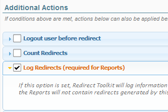
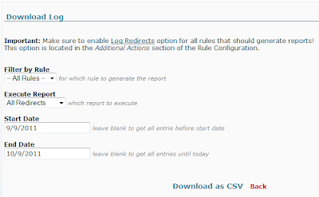

# Reports

Starting with version 2.0 Redirect Toolkit has a configurable reporting framework capable of generating CSV (Excel) reports from SQL Queries. Before this feature was implemented there was only one kind of report available which was actually a log with all the redirects that occurred in the system within the selected time period. 

## Important 

For the reporting framework to work the Logging option must be enabled for all rules you want included in the reports. Otherwise the logs are not saved and there is no data from which Redirect Toolkit could build the reports.

There are two reports available in Redirect Toolkit right now. One is a report with all redirects that happened for selected rules, the other is a referrer count report which shows how many redirects were executed for which distinct referrer.

## Creating Custom Reports

Creating new custom reports is easy if you have basic knowledge on XML and SQL. Redirect Toolkit loads all report types from configuration files. These are located in the */DesktopModules/RedirectToolkit/config/Reports* folder. The only file in this folder should be called ".defaults.xml". This file contains definitions for the prebuilt reports and you shouldn't modify this file because it will get overwritten on update. Instead, create new XML files that have the same structure as the ".defaults.xml" which will remain unmodified during upgrades.

The XML file has the following structure:

* reports  - root node
    * report - represents report definition; multiple reports means multiple occurrences of this node
        * title - friendly UNIQUE title to display in the UI
        * sql - the query that will return the results
    *report - another report
        * ...

The *sql* query can make use of some special syntax to mark placeholders for specific data. Following tokens are available:

* {databaseOwner} - this will get replaced with the actual database owner
* {objectQualifier} - this will get replaced with the object qualifier you provided during DNN installation
* {reportFilters} - this will append additional clauses provided through the UI, such as date range and rule IDs

You can create as many XML files as you need. Each XML can contain definitions for any number of reports. The XML configuration files are parsed in the alphabetical order (in which they appear in Windows Explorer). If a report with the same title exists in two files, then the one parse later will be used. This is useful to override reports. For example, you can override the default *All Redirects* report by creating a new XML file with a report also named All Redirects.

The reports configuration is parsed by Redirect Toolkit and displayed in the *Reports Screen* shown in image below.

Besides choosing the report, you can also specify a Redirect Rule to generate the report for (or select to include all rules) and a date interval.

Finally, the report can be downloaded as CSV. This is simple and powerful way to present reports because in Excel the data can be further processed and transformed in graphs or other meaningful visual data.
